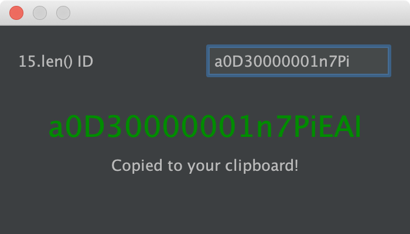

🌭 Salesforce ID Generator
==========================

This simple plugin generates a 18 digits ID out of a 15 digits ID for Salesforce.

To use it, just press `⌘ + ⌥ + s`.

When loaded it will try to check on your clipboard for a 15 length string, if
it finds it then an automatically conversion is done and copied to your clipboard,
otherwise, you can fill in the _15.len() ID_ field manually.

#### Author

- Jefersson Nathan - [@malukenho](http://github.com/malukenho)
- Airton Zanon - [@airtonzanon](http://github.com/airtonzanon)
- Alexandre Eher - [@EHER](http://github.com/EHER)
